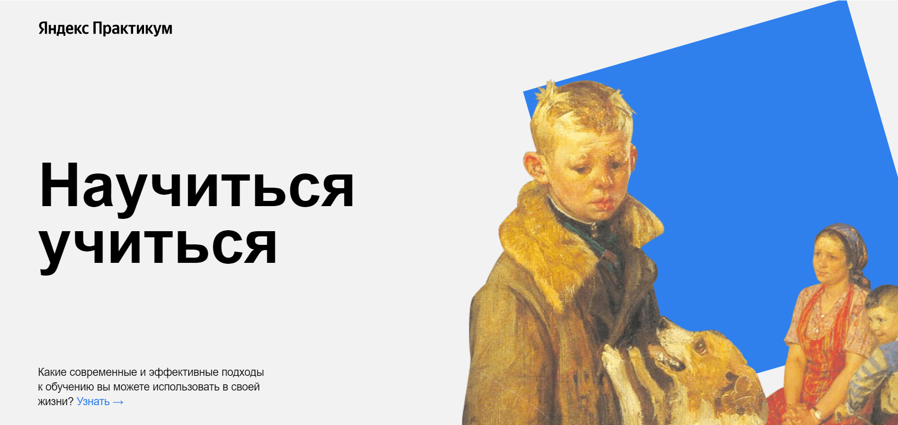

# Научиться учиться
Alt-H1

## Давно ли вы сталкивались с тем, что начать изучать что то новое совсем нет желания / лень / да и лучше вообще в кровати поваляться под фильм? (даже мне сейчас захотелось..)

По статистике Британских ученых более 70% опрошенных согласились с тем, что обчение чему-то новому дается с большим трудом.

## Так что же с этим делать? Как __научиться _учиться__?

Углубившись в проблему, почитав литературу, я собрала для Вас самые дельные советы, которые, я надеюсь, Вам помогут!

## Описание

Проект реализован на чистом HTML и CSS. Проект содержит 11 блоков, а именно:

1. Шапка.
2. Главные проблемы в обучении.
3. Техники обучения.
4. Видео на TED.
5. История Барбары Оакли.
6. Метод Фейнмана.
7. Цифры и факты.
8. Весь мир - школа.
9. Принципы обучения.
10. Полезные ресурсы.
11. Подвал.

## Примеры и технологии

